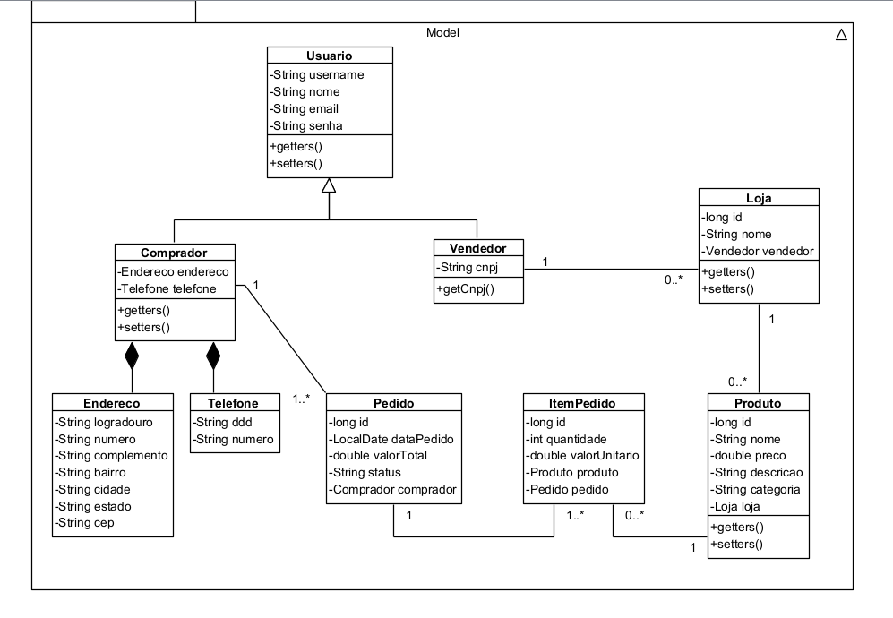
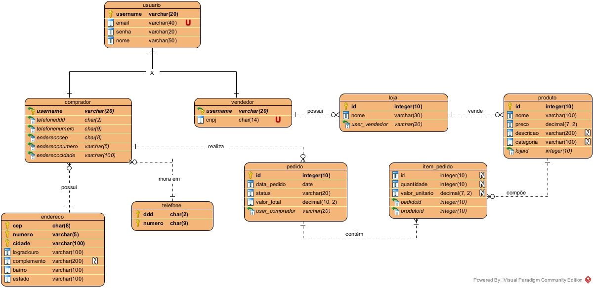
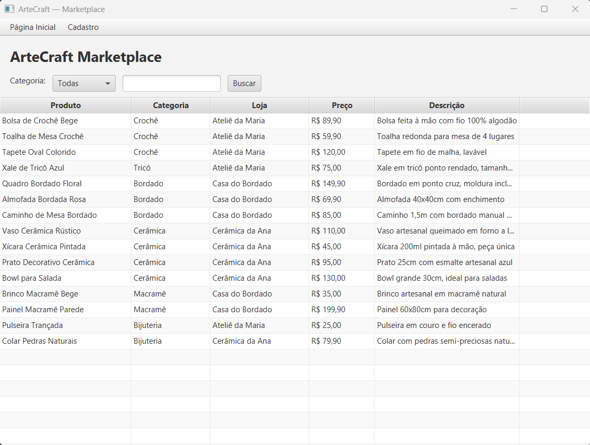
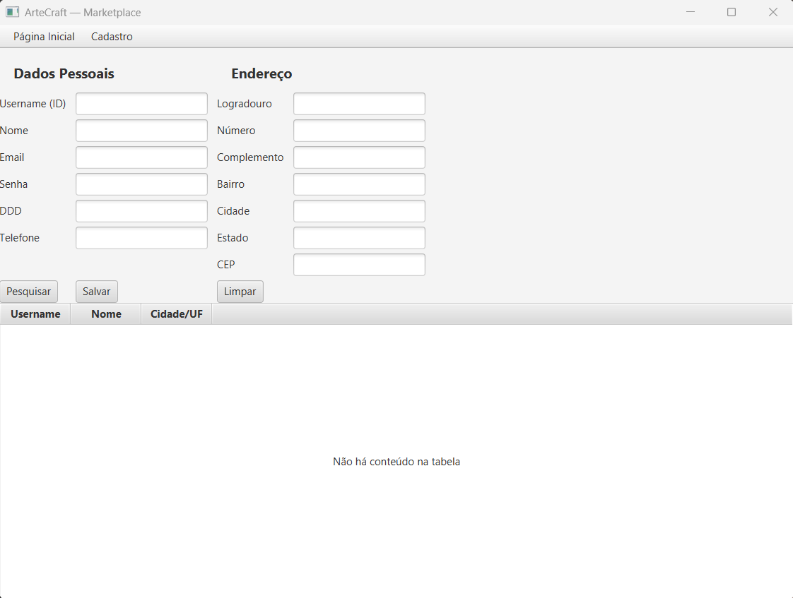
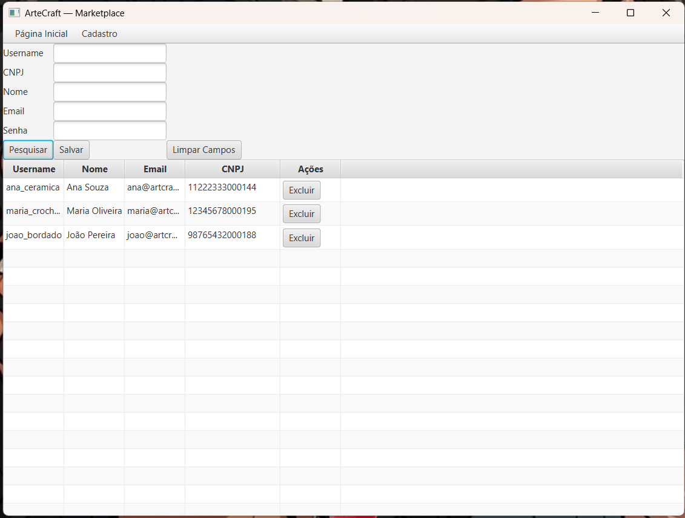
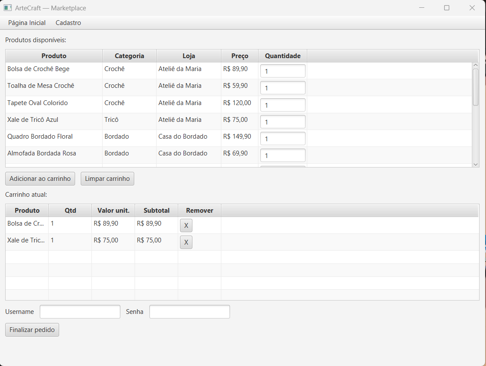
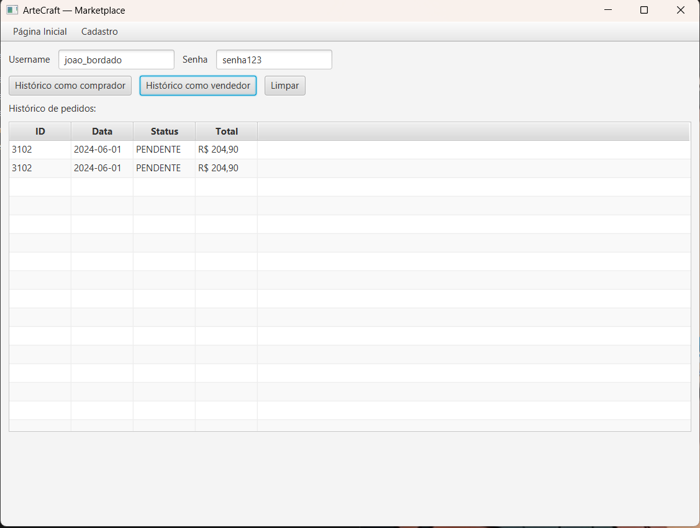
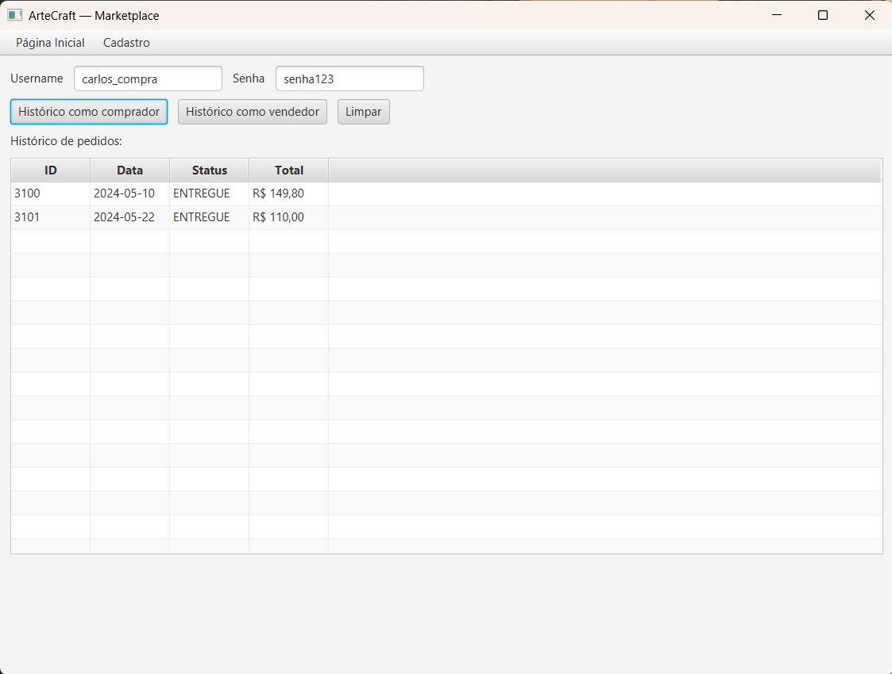

# Sistema de MarketPlace em JavaFX

Este projeto tem como objetivo a simulação de um Marketplace utilizando JavaFX, inspirado em soluções já existentes no mercado.
O desenvolvimento segue o padrão de arquitetura MVC (Model-View-Controller), com uso de Gradle para gerenciamento de dependências e integração com um banco de dados relacional (SQL Server) para controle e persistência das informações.

## Tecnologias Utilizadas 

  
  
  
  

  
  
  
  
  

Abaixo estão descritas todas as fases previstas para o desenvolvimento do projeto.

## FASE 1 - Levantamento e Análise de Requisitos

Nesta fase, foram realizadas a identificação e documentação dos requisitos do sistema, conforme estudado em Engenharia de Software.
Todos os requisitos são baseados na existência de um sistema de vendas já existente, o [Etsy](https://www.etsy.com/)

### Requisitos Funcionais

| **ID** | **Requisito Funcional** | **Descrição** | **Ator** |
| :--- | :--- | :--- | :--- |
| **RF01** | Efetuar login | O sistema deve permitir que os utilizadores façam login. | Comprador / Vendedor |
| **RF02** | Cadastrar Loja | O sistema deve permitir que o vendedor crie o perfil de sua loja. | Vendedor |
| **RF03** | Administrar Produtos | O sistema deve permitir que o vendedor administre os seus produtos cadastrados. | Vendedor |
| **RF04** | Navegar por Categoria | O sistema deve permitir que o comprador navegue pelo sistema através de filtros. | Comprador |
| **RF05** | Gerenciar Carrinho | O sistema deve permitir adicionar, excluir e alterar produtos do carrinho. | Comprador |
| **RF06** | Fechar Pedido | O sistema deve processar as compras feitas. | Comprador |
| **RF07** | Consultar Histórico | O sistema deve permitir que o comprador veja o histórico de produtos comprados e o vendedor veja o de produtos vendidos. | Comprador / Vendedor |

### Requisitos Não Funcionais

| **ID** | **Requisito Não Funcional** | **Descrição** |
| :--- | :--- | :--- |
| **RNF01** | Persistência de Dados | O sistema deve usar obrigatoriamente um banco de dados relacional (SQL) para armazenar as informações. |
| **RNF02** | Interface Gráfica | A interface com o usuário deve ser desenvolvida utilizando a tecnologia JavaFX. |
| **RNF03** | Padrão de Arquitetura | O sistema deve seguir o padrão de arquitetura BCE / MVC (Fronteira, Controle e Entidade). |
| **RNF04** | Segurança de Acesso | O sistema deve ser protegido por meio de controle de acesso com login e senha. |
| **RNF05** | Integridade de Dados | O banco de dados deve garantir a consistência e o relacionamento correto entre as tabelas do sistema. |

## FASE 2 - Modelagem e Diagramação  

### Diagramas Criados  
Todos os diagramas foram desenvolvidos no Visual Paradigm 17.2.

✅ **Diagrama de Caso de Uso**  

✅ **Diagrama de Classes**  

✅ **Diagrama de Entidade Relacionamento**  

## FASE 3 - Banco de Dados

Nesta fase foi desenvolvido o Banco de Dados com SQL Server, [veja aqui](https://github.com/DaianeTararam/marketplace-javafx/blob/main/app/src/main/resources/db_ArteCRAFT.sql).
O arquivo db_ArteCRAFT já possui os dados para teste do sistema.

## FASE 4 - Desenvolvimento em Java com JavaFX e SGBD SQL Server  

Nesta fase, desenvolvemos a aplicação utilizando **Java com JavaFX** na interface e Gradle para organização das dependências.
O desenvolvimento foi realizado de acordo com o aprendizado das matérias de Programação Orientada à Objetos, Banco de Dados e matérias de Engenharia de Software conforme exigido.

## FASE 5 - Testes

Houveram testes realizados para observação do sitema em funcionamento. 
Abaixo esta as telas testadas. 

**Tela Inicial**

**Tela para cadastro do comprador**

**Tela para cadastro do vendedor**

**Tela para realizar novo pedido**

**Tela para visualização de histórico de pedidos de loja**

**Tela para visualização de histórico de pedidos de loja**

## FASE 6 - Geração do Arquivo Jar

O arquivo Jar, encontra-se [aqui](https://github.com/DaianeTararam/marketplace-javafx/blob/main/app/src/main/resources/ArteCraft.jar).

**Desenvolvido por Daiane Tararam**  
*Estudante de Análise e Desenvolvimento de Sitemas na Fatec ZL*
